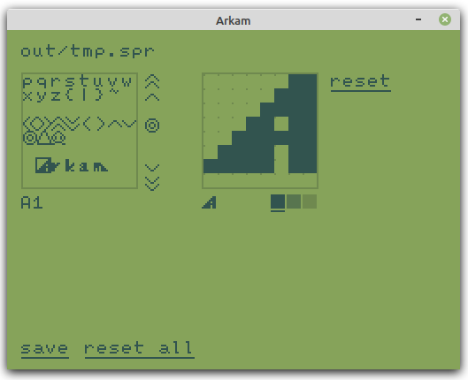
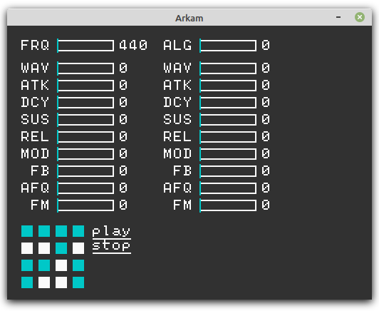

# Arkam - Stack VM and Forth

Purposes

- Build small cli tools
- Sound/Graphic tinkering environment

## Influenced by

- [uxn](https://wiki.xxiivv.com/site/uxn.html)
- [Mako](https://github.com/JohnEarnest/Mako)
- [Retro](http://www.retroforth.org/)

## Tools

- arkvm: console vm
- arkam: with forth
- sarkvm: sdl vm with fm synthesizer
- sarkam: with forth

## Meta

Edit `lib/meta.f` and `lib/core.f`.

Then build `out/forth1.ark` with `make meta`.

Check with `make meta-check && make meta-test`.

Finally install new forth.ark with `make meta-install`.

## Screenshot

[sprited](tools/sprited.f)

[fmparams](example/fmparams.f)

## LICENSE

[MIT License](LICENSE.txt)

Some sprites refer to [IchigoJam Font](https://15jamrecipe.jimdofree.com/%E3%83%84%E3%83%BC%E3%83%AB/%E3%83%95%E3%82%A9%E3%83%B3%E3%83%88-truetype/)
[CC BY](http://creativecommons.org/licenses/by/4.0/) [IchigoJam](https://ichigojam.net/) / [BALLOON | FU-SEN](https://15jamrecipe.jimdofree.com/)